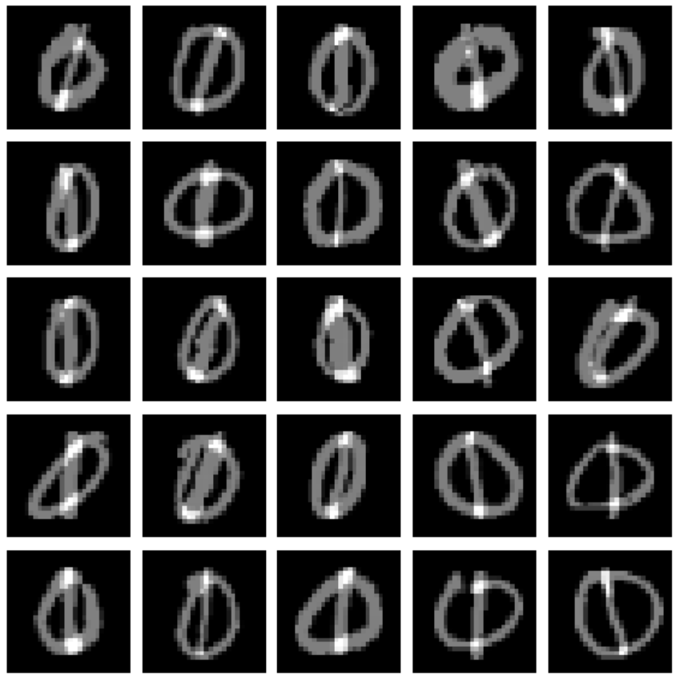
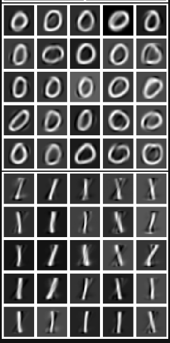

### TMA4215 Numerical Mathematics
# Project 1: Gram Schmidt and Tikhonov regulation
In this project we are interested in the case of underdetermined linear systems. We will use methods such as Gram Schmidt and Tikhonov regulation.    

From  

To  

